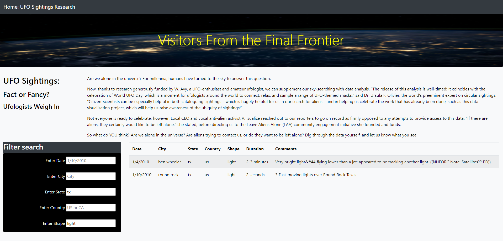
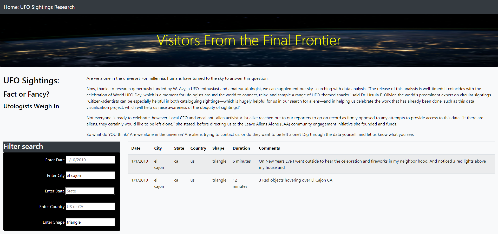

# Visitors From the Final Frontier

## Overview:

Are we alone in the universe? For millennia, humans have turned to the sky to answer this question.

Now, thanks to research generously funded by W. Avy, a UFO-enthusiast and amateur ufologist, we can supplement our sky-searching with data analysis. "The release of this analysis is well-timed: It coincides with the celebration of World UFO Day, which is a moment for ufologists around the world to connect, relax, and sample a range of UFO-themed snacks," said Dr. Ursula F. Olivier, the world's preeminent expert on circular sightings. "Citizen-scientists can be especially helpful in both cataloguing sightings—which is hugely helpful for us in our search for aliens—and in helping us celebrate the work that has already been done, such as this data visualization project, which will help us raise awareness of the ubiquity of sightings!"

Not everyone is ready to celebrate, however. Local CEO and vocal anti-alien activist V. Isualize reached out to our reporters to go on record as firmly opposed to any attempts to provide access to this data. "If there are aliens, they certainly would like to be left alone," she stated, before directing us to the Leave Aliens Alone (LAA) community engagement initiative she founded and funds.

So what do YOU think? Are we alone in the universe? Are aliens trying to contact us, or do they want to be left alone? Dig through the data yourself, and let us know what you see.

## Using the Search Mechanism:

To use the search through different criteria, fill in the various text boxes with the text to search. For example, to search for UFO sightings in the state of Texas in the shape of light, fill in "tx" for the state and "light" for the shape, the result will look like:

For example, to search for UFO sightings in the city of El Cajon in the shape of a triangle, fill in "el cajon" for the state and "triangle" for the shape, the result will look like:

## Summary:

### Drawback of this new design:

The research is as good as the data. If the data leads to no UFO events, then it is difficult to conclude whether a specific city and state has been visited by aliens.

### Recommendations for further development:

Although clicking the button on the top-left of the site returns us to the initial state, there should be a "clear" button to return to that state for more clarity.

There could be an additional mechanism to ignore whether the user inputs small or capital letters in the search boxes.
